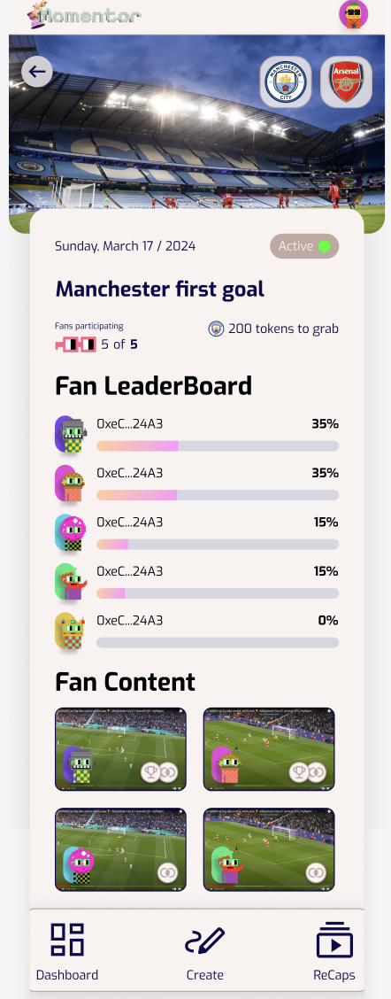
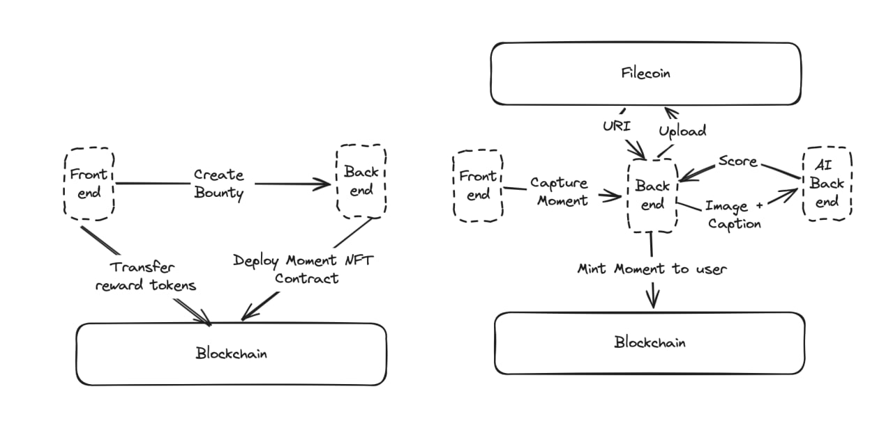

# Momentor: Rewards Protocol for Quality Content Contribution

**Momentor** is a gamified user engagement protocol that leverages content contribution to cultivate and maintain a dedicated user base. This approach not only fosters a vibrant community but also generates high-quality content for training AI models. By simulating event outcomes and providing unique perspectives on venues, Momentor stands at the forefront of AI and blockchain integration in the event industry.

## Overview

At its core, Momentor was built to engage users during an event by rewarding them for capturing the best moments. It utilizes blockchain technology to give organizers full ownership of the data and AI techniques motivate the users to upload high-quality content. The organizer can create multiple bounties during an event, e.g. first goal of the match, the DJ at a NFT club party, a mascot of a famouse DeFi exchange at a blockchain hackathon. Then, the momentors capture the moment by taking a picture and feeding it into our AI model that gives them a score of how relevant the picture is. Subsequently, if the user fulfilled a certain threshold then a NFT is minted to the user, which would make them eligible to receive rewards and appear in the leaderboard.

Momentor aims to motivate users to share their content, thereby enriching the user base and offering a deeper understanding of individual perspectives. This wealth of content becomes a valuable resource for event organizers, enabling them to gain insights into attendee behaviors and preferences. Leveraging the power of AI and blockchain, organizers can directly access insightful data from users' viewpoints, ensuring data ownership and confidentiality.

## Key Features

- **Gamified User Engagement**: Through tokens rewards and community recognition, our platform incentivizes user participation at events and content creation.
- **AI-Driven Rewards**: Engaging event participants not only builds a loyal community but also encourages the sharing of more insightful data. By rewarding contributions with tokens based on the quality of their content, users are recognized for their active participation and valuable input.
- **Decentralized Data Ownership**: The data is uploaded to filecoin and ipfs with lighthouse.storage thus allowing the event organizers full ownership over monetization and distribution of the data.
- **Gasless Experience**: We don't require users to send any transaction, except when the organizer has to transfer the reward tokens to the smart contract, thus enriching the user experience and retention to another level.

## Future Implications

Momentor not only revolutionizes the way event organizers interact with and understand their audience but also opens up new avenues for data utilization. Through AI simulations, clubs and venue owners can offer virtual reality previews of seat views, enhance security measures, and tailor events to match audience preferences more closely.

## How It Works

Momentor integrates seamlessly with existing platforms, requiring minimal setup from both organizers and users. Through a user-friendly interface, participants can upload their content, receive immediate feedback from AI analysis, and earn rewards for their contributions. On the backend, blockchain technology ensures the security and authenticity of data transactions, making Momentor a robust solution for the future of event management and fan engagement.

## Architecture

TODO: Tech stack

## License

This project is licensed under [MIT License](./LICENSE)
